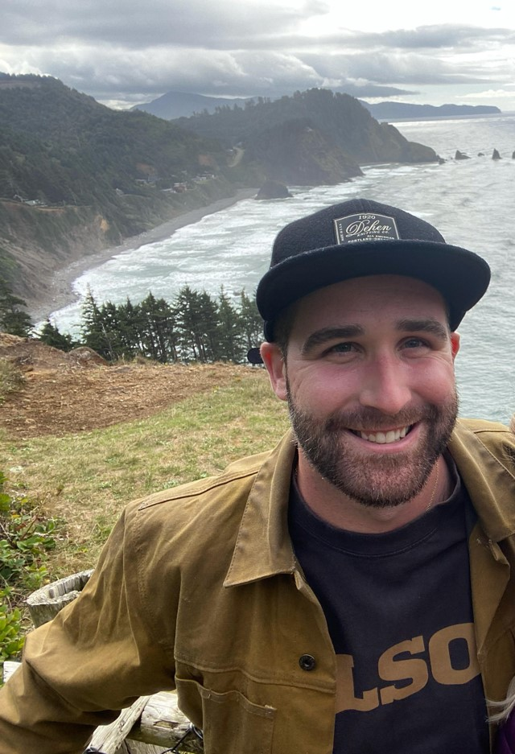

<h1 align="center">About Me</h1>

 
              If you came to this page means, you want to know more about me. Thanks for taking your time to visit here, please allow me to introduce myself.

 
              I'm Stephen Zimmermann, Electrical Controls Engineer with 10+ years of expertise in programming and automating industruial equipment. 
            
 
            
I am working on translating my current skills (always trying to learn new ones) into a Data Scienctist with an emphasis on Machine Learning .

 

              I enrolled in University of California, Berkeley's Data Analytic Program in March 2022 besides my full time engineering job to help kickstart my transistion and have since learned: 
             <ul> <il> - VBA </ul></il> 
             <ul> <il> - Python (VS Code, Jupyter Notebooks, Pandas, NumPy, Matplotlib, API Interactions ) </ul></il> 
             <ul> <il> - Databases (ETL, SQL, pdAdmin, MongoDB) </ul></il> 
             <ul> <il> - Front End Web (HTML, CSS, Bootstrap, Javascript, Geomapping Leaflet) </ul></il> 
             <ul> <il> - Data Visualization with Tableau </ul></il> 
             <ul> <il> - R programming </ul></il> 
             <ul> <il> - Big Data Analytic with Spark  </ul></il> 
			 <ul> <il> - Maching Learning  </ul></il> 
             <ul> <il> - Realized I can always learn new things and new ways to apply my current skills! </ul></il> 
            

 
 Outside of my passion for programming, I enjoy spending time with my family, traveling, hiking, biking, and cooking. 
            

 

<h1 align="center">My Employment History</h1>

                <h4>Lead Controls Engineer at USNR</h4>
                
November 2015 – Present
                

                <ul class="w3-ul" style="font-weight: 500;">
                  <li> Designed, programed, and commissioned industrial controls systems which included discrete & analog I/O, motion control, 
vision applications, and networking for engineered wood product companies.
                  </li>
                  <li>
                     Vital role in creating a unified controls group and standardizing code across different machine specialty groups.
                    </li>
                  <li> Trained new engineers to develop code, successfully start-up installations, and how to seek out needed resource to 
become effective controls engineers.
                  </li>
                  <li> Field experience commissioning and servicing control systems included PLC’s, HMI’s, VFD’s, Servos.
                  </li>
                

<h4>Autotool Inc.</h4>

Senior Controls Engineer

 
 June 2012 – September 2015 

           <ul class="w3-ul" style="font-weight: 500;">
                  <li>Worked multiple roles in a project leader position to develop OEM electrical-mechanical equipment and integrate robotic 
and motion controls for autonomous machines for car manufactures; i.e for Honda, GM, Ford. 

                  </li>
                  <li>
                     Designed large multi-platform communication networks: CC-Link, DeviceNet, Ethernet with multiple protocols: CIP, 
Ethernet IP, DCS capabilities; and multiple topologies: star, DLR, ring, bus, linear. 

                    </li>
					<li>
                     Developed and utilized a strategy to export component lists from AutoCAD to Excel to create custom BOMs: Allowed for 
component quantity tracking, price tracking, and component availability. 
 

                    </li>
                </ul>
				
                <h4>Omegadyne</h4>

Engineer Intern

 
 September 2011 – March 2012

           <ul class="w3-ul" style="font-weight: 500;">
                  <li>Hands on calibration and testing of pressure transducers and indicators for overload ability, sensitivity, linearity, balance, 
hysteresis, and temperature compensation. 

                  </li>
                  <li>
                   Used Six Sigma applications to evaluate Authorized Returns.</li>
                </ul>
            
<h1 align="center">My Education</h1>

  <h4>Bachelors of Science Electrical and Computer Engineering , The Ohio State University (Columbus, OH)</h4>
                
June 2012 

                <h4>Masters of Engineering Management, Ohio University (Athens, OH)
                </h4>
                
December 2018 

				<h4>Data Analytic Boot Camp, University of California (Berkeley, CA)
                </h4>
                
September 2022 

  
  

        <h1 align="center">My Skills</h1>       

  <h4>Soft skills</h4>
  <ul class="w3-ul" style="font-weight: 500;">
                <li> Excellent leadership, communication (written and oral) and interpersonal skills.</li>
                <li> Highly innovative for investigating and researching different processes to offer different improvements and solution for the benefit of the organization. </li>
                <li> Flexible and self-directed - Strong organization skills.</li>
                <li> Demonstrated organizational skills and detail orientation with ability to multi-task in a fast-paced environment with competing priorities.</li>
                <li> Strong interpersonal skills. The ability to translate technical jargon into terms that business users can understand.</li>
                <li> Experience creating information/control systems and system standards for fast-paced manufacturing environments.</li>
                
              </ul>
  <h4>Technical skills</h4>
                <ul class="w3-ul" style="font-weight: 500;">
                  <li>Python,R Programming, VBA, HTML, Machine Learning, Statistics, Tableau, SQL, Problem-Solving (Advance), Mathematics, Javascripts, AWS (Basic), Data Modeling
                  </li>
                  
               
   

  !<h1 align="center">My References</h1>
  !<h4>Tony LaSalata, Controls Manager at USNR </h4>
  !<ul> <li> Tony.LaSalata@usnr.com</li></ul>

